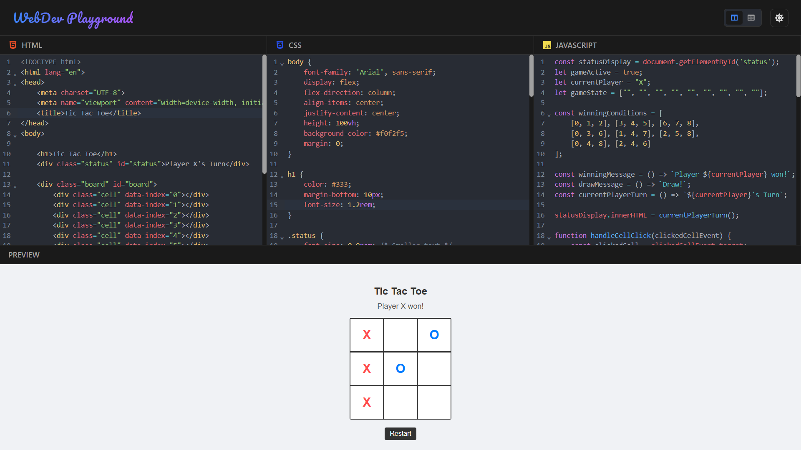

# 🚀 CodeEditor

A modern, multi-language code editor built with **React** that supports live preview and execution of **HTML**, **CSS**, and **JavaScript** code. Designed for developer productivity, it features a sleek interface, split views, and dark mode.

<br>



## 🔗 [Visit the Live Project ✨](https://webdev-playground.netlify.app/)

<br>

## 🛠️ Tech Stack & Tools


<br>

## ✨ Features

- 🧠 **Multi-language support:** HTML, CSS, JavaScript
- ⚡ **Live preview:** Real-time rendering for web languages
- 🌙 **Dark mode:** Toggle for a comfortable coding experience
- 🔲 **Flexible Layouts:** Switch between Split and Tabbed views

<br>

## 📦 Installation & Setup

```bash
# Clone the repository
git clone https://github.com/Milind-Yadav07/CodeEditor.git

# Install dependencies
npm install

# Start the development server
npm run dev
```

<br>

## 🧪 Usage Guide
- Select your preferred language editor.
- Write your code in the editor pane.
- HTML/CSS/JS: Live preview updates instantly.
- Toggle dark mode from the navbar.
- Switch layout views using the icons in the navbar.

<br>

## 🤝 Contributing

Contributions are welcome! Whether it's a bug fix, feature suggestion, or UI improvement.

