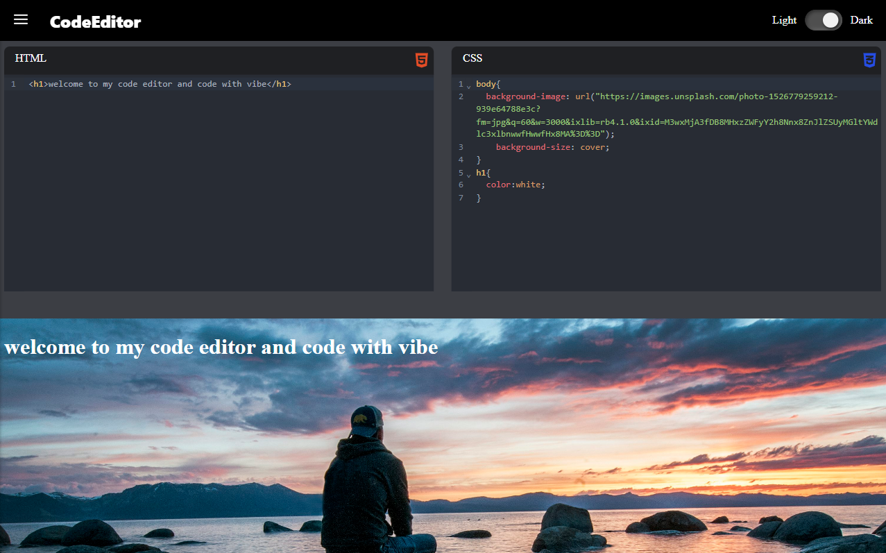

# CodeEditor

A modern, multi-language code editor built with React that supports live preview and execution of HTML, CSS, JavaScript, Python code. Designed with developer productivity in mind, it features a clean interface with sidebar navigation, dark mode, and persistent code storage using localStorage.

<br>
<br>




<h1><a href="https://milind-code-editor.netlify.app/">Visit</a></h1>


## Features

- **Multi-language support:** Edit and preview code in HTML, CSS, JavaScript, Python.
- **Live preview:** Real-time rendering of HTML/CSS/JS and output display for Python.
- **Python execution:** Runs Python code directly in the browser using Pyodide.
- **Dark mode:** Toggle between light and dark themes for comfortable coding.
- **Sidebar navigation:** Easily switch between different language editors.
- **Persistent storage:** Code is saved automatically in localStorage to prevent data loss.

## Technologies Used

- React for building the user interface.
- CodeMirror as the code editor component with syntax highlighting.
- Pyodide for running Python code in the browser.
- React Icons and FontAwesome for UI icons.
- Vite as the build tool and development server.

## Installation and Running

1. Clone the repository:

   ```bash
   git clone <repository-url>
   ```

2. Install dependencies:

   ```bash
   npm install
   ```

3. Start the development server:

   ```bash
   npm run dev
   ```

4. Open your browser and navigate to `http://localhost:3000` (or the port shown in the terminal).


## Usage

- Use the sidebar to select the language editor you want to work with.
- Write your code in the editor pane. For HTML/CSS/JS, the live preview updates automatically.
- For Python, the code is executed using Pyodide and output is displayed below.
- Toggle dark mode using the switch in the navigation bar for a comfortable coding experience.
- Your code is saved automatically in localStorage, so you can refresh or close the browser without losing your work.

## Additional Notes

- The project dynamically loads external scripts for Pyodide compiler to keep the initial bundle size small.
- Error handling is implemented for Python execution to provide feedback in the output pane.
- The editor uses CodeMirror with language-specific syntax highlighting and line wrapping for better readability.


This project demonstrates a practical approach to building a versatile web-based code editor with modern frontend technologies and browser-based language execution.
